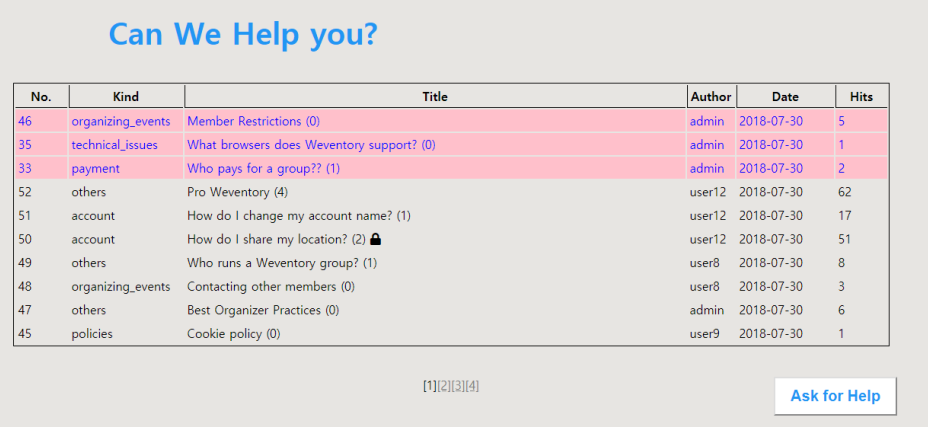

# PP03_Bulletin-board
<h4>This is a bulletin board. 
I made this as a part of the group project, "Weventory".  
</h4>
 
 

     

 
 
<h3><i>The page is divided 3 parts according to their roles.  
-Bulletin board 
-Write article 
-Read article </h3></i>
   
<h2>Part A. Bulletin board</h2>
</h4>
<h3>1. Sticky articles</h3>
Admins can write sicky articles which are arranged on the top of the bulletin board. 
Sticky articles are distinguished with "Red".
  
<h3>2. Showing the number of reply articles(child ariticles)</h3>
Next to the title, how many reply articles each article has is marked.
  
<h3>3. Hits</h3>
The 'hits' column shows how many times users have clicked the article.
  
<h3>4. Ask for help</h3>
The button leads to the page where users can send their articles. 
     
<h2>Part B. Wrtie article</h2>
<h3>1. Sticky mode</h3>
If the user is an admin member, an additional option, sticky mode'll be added.  
<h3>2. Password</h3>
If a user wants to make the article private,  
By setting the password, the access to the article can be resticted.
  
<h3>3. Tags</h3>
 

     

 
<b>Conditions</b> 
- Max. 10 tags 
- The same tag can't be added. 
 
If the conditions was not met, an alert message'll report about the error. 
  
<h3>4. File attatchment</h3>
 

     

 
<b>Conditions</b> 
- Max. 3 files 
- The same file can't be added. 
 
If the conditions was not met, an alert message'll report about the error. 
     
<h2>Part C. Read article</h2>
<h3>1. Private article</h3>
If a user enters the correct password for the article, the content of the article'll be shown. 
  
<h3>2. Reply articles</h3>

     

 
A article can have multiple reply articles. 
*<b>Private child article</b>
If an user set a password for the reply article, a child article also can be a private article.
  

