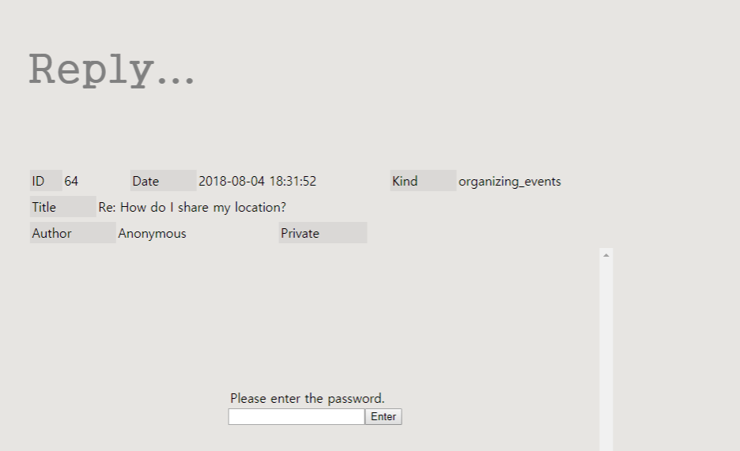

# PP03_Bulletin-board
<h4>게시 
본 게시판은 그룹 프로젝트 "Weventory"(https://github.com/wcodingforever/weventory)에 참여할 당시, 
도움이 필요한 User들과 소통을 위한 "Help" 페이지로 만들어졌습니다. 
</h4>
 
 

     

 
 
<h3><i>게시판은 하나의 web page로 만들어졌으며, 역할에 따라 3 parts로 나뉩니다.  
A. Bulletin board 
B. Write article 
C. Read article </h3></i>
 
페이지가 어느 역할을 유저에게 수행하고 있느냐에 따라, 그 역할을 담당하는 part는 toggle on되어 보여지고, 
나머지 parts는 toggle off되어 보여지지 않게 되는 방식으로 작동합니다. 
  

<h2>Part A. Bulletin board</h2>

<h3>1. Sticky articles</h3>
운영자들은 전체공고글등을 게시할 때, 게시판 맨 위에 정렬되는 sticky articles을 작성하여 수 있습니다. 
Sticky articles은 분홍색 바탕색으로 일반 글들과 구분되어 보여집니다. 
  

<h3>2. 답글(Reply)의 수 표시</h3>
각 글의 제목 옆에 해당 글에 얼마나 많은 답글이 달렸는 지가 표시됩니다.
  

<h3>3. 조회수</h3>
'hits' column의 값들은 해당 글의 조회수를 나타냅니다. 
  

<h3>4. Ask for help</h3>
유저는 Ask for help 버튼을 누름으로써, 요청글을 쓸 수 있는 Read article part로 이동하게 됩니다. 
     

<h2>Part B. Wrtie article</h2>
<h3>1. Sticky mode</h3>
유저가 관리자라면, form에 "sticky mode" 옵션이 추가되어 나타나지게 됩니다.
  
<h3>2. 답글 제목 자동 생성하기</h3>
유저가 답글을 쓰기위해 Write article part로 이동된 거라면, 글의 제목은 <b>"Re: (The article title to reply)"</b> 
으로 자동 생성되어집니다.
  

<h3>3. 비밀번호 설정</h3>
모든 글들은 해당 글에 설정된 비밀번호를 입력하지 않으면 볼 수 없는 접근이 제한된 private articles과 
그렇지 않고 모두에게 공개되는 public articles들로 분류될 수 있습니다. 
  

<h3>4. Tags</h3>
 

     

 

<h4>조건 사항</h4>
- 최대 10 tags 허용 
- 같은 내용의 tag 불가 
 
어느 조건이라도 충족이 안될 경우, 해당 error를 알리는 alert 창이 띄워집니다. 
  

<h3>5. 파일 첨부</h3>
 

     

 

<h4>조건 사항</h4>
- 최대 3 파일 허용 
- 같은 파일 첨부 불가 
 
어느 조건이라도 충족이 안될 경우, 해당 error를 알리는 alert 창이 띄워집니다.
     

<h2>Part C. Read article</h2>
<h3>1. Private article</h3>
ㅖrivate artilce들의 내용은, 유저가 정확한 패스워드를 입력했을 시에만 보여지게 됩니다.
  
<h3>2. Reply articles</h3>
 

     

 
유저들을 하나의 글에 여러개의 답글(Reply)들을 달 수 있습니다. 
 
<h4>Private reply article</h4>
답글들 또한 비밀번호가 설정된다면, private article이 될 수 있습니다.
     

P.S. 본 게시판은 연습을 목적으로 만든 작품이 보니, 여러가지 부족한 점이 많습니다. 
private 데이터를 전송또는 받을 시 hash code를 사용지 않아 보안상으로 흠이 있고, 
JS로 HTML을 생성할때, 연습을 위해 여러 methods를 써봤는데, 효율적인 방법은 아니었습니다. 
하지만 이런 문제점들을 개선할 예정입니다. 
   

----------------------------------------------------------------------------------------------------------------------------------------
  
<h4>This is a bulletin board. 
I made this as a part of the group project, "Weventory"(https://github.com/wcodingforever/weventory). 
It was "help" page of "Weventory" app which was to receive and reply to customers' help requests. 
</h4>
 
 

     

 
 
<h3><i>The bulletin board was made on one single page. The page is divided into 3 parts according to their roles.  
A. Bulletin board 
B. Write article 
C. Read article </h3></i>
   

<h2>Part A. Bulletin board</h2>

<h3>1. Sticky articles</h3>
Admins can write sicky articles which are arranged on the top of the bulletin board. 
Sticky articles are distinguished with "pink" background color.
  

<h3>2. Showing the number of reply articles</h3>
Next to the title, how many reply articles each article has is marked.
  

<h3>3. Hits</h3>
The 'hits' column shows how many times users have clicked the article.
  

<h3>4. Ask for help</h3>
The button leads to "Write article" part where users can send their articles. 
     

<h2>Part B. Wrtie article</h2>
<h3>1. Sticky mode</h3>
If the user is an admin member, an additional option, sticky mode'll be added.
  
<h3>2. Automatically creating the title for a reply article</h3>
If a user tries to write a reply article, the title for the reply article'll be created automatically 
in this form, <b>"Re: (The article title to reply)"</b>.
  

<h3>3. Password</h3>
If a user wants to make the article private,  
By setting the password, the access to the article can be resticted.
  

<h3>4. Tags</h3>
 

     

 

<h4>Conditions</h4>
- Max. 10 tags 
- The same tag can't be added. 
 
If any of the conditions was not met, an alert message'll report about the error. 
  

<h3>5. File attatchment</h3>
 

     

 

<h4>Conditions</h4>
- Max. 3 files 
- The same file can't be added. 
 
If any of the conditions was not met, an alert message'll report about the error. 
     

<h2>Part C. Read article</h2>
<h3>1. Private article</h3>
If a user enters the correct password for the article, the content of the article'll be shown. 
  
<h3>2. Reply articles</h3>
 

     

 
A article can have multiple reply articles.  
 
<h4>Private reply article</h4>
If an user set the password for a reply article, the reply article also can be a private article.
     

P.S. Since I made this as a practice, it has many incomplete parts.  
For example, not using hash codes when sending passwords, inefficient ways to create HTML elements etc. 
I am planning to improve those parts soon.

